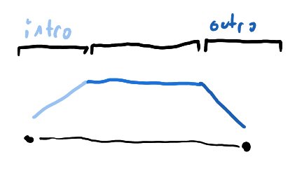
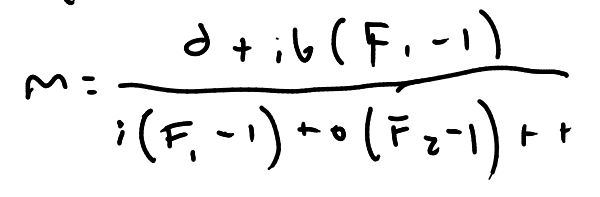
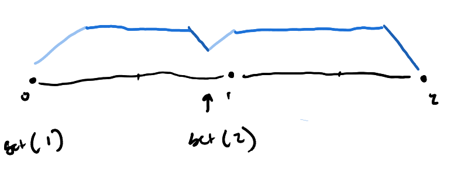
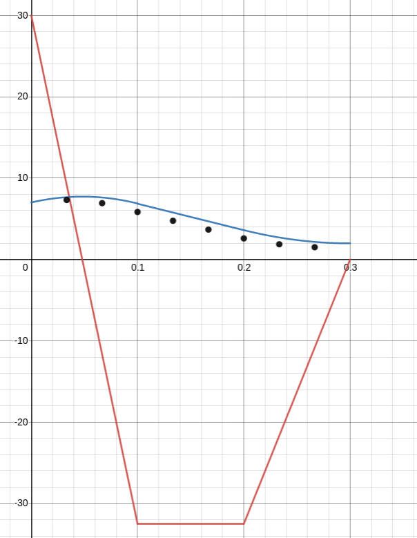

# interpolate

Basically like [awestore](https://github.com/K4rakara/awestore) but not really.

The general premise of this is that I don't understand how awestore works. That
and I really wanted to be able to have an interpolator that didn't have a set
time. That being said, I haven't made an interpolateor that doesn't have a set
time yet, so I just have this instead. It's an awestore clone, but from what I
can tell it does things a little differently. It essentially allows you to
construct your slope curve much more meticulously.



You construct a slope curve like this. Except you don't specify the height or
anything, just the easing function, the intro duration and the total duration.
It calculates the height it should be at to travel whatever distance you like
using the below unecessarily complicated formula;



Furthermore, with this method, it makes you turning around as clean as can be.
Are you in the middle of an animation? Well fret not because should you start
another animation it will take into account the current slope and use it to
generate the subsequent one (in the formula, it's b) to make interruptions
buttery smooth.



To actually calculate the position, it adds or substracts the y-value of the
slope curve from the current position to simulate the antiderivative. There are
a couple minor problems, however. When interrupting, should you go from dx to a
different dx of the same sign, it will very slightly undershoot. Normally if you
go from a dx to a dx of a different sign it would overshoot, but this simulates
the simulation (??) to correct for this (because while undershooting isn't
really noticible, overshooting certainly is). In the future these corrections
will probably be made more configurable.



I'm also planning on writing a "target" function because that is what I
originally intended this to be for. It'll be solving for time instead of the
maximum slope, so that'll be a fun xournalpp mess.

To create your own easing functions, you must have a table with two items:

1. `F`, which is the antiderivative of the easing function from 0 to 1. For
   f(x)=x, `F` would be 1/2. for f(x)=x^2, `F` would be 1/3.
2. `easing`, which is a function with a single parameter, `t` or `x` or
   whatever, which is the graph of the easing function. For f(x)=x, it'd be
   `easing = function(t) return t end`

An example usage is like this:
```lua
interpolator = require "interpolator"

my_timed = interpolator.timed {
	intro = 0.1,
	duration = 0.3,
	easing = interpolator.quadratic,
	pos = 4
}

my_timed:subscribe(function(pos)
	print(pos)
end)

my_timed:set(8)
```

and this will get you some kinda output which goes from 4 to 8 in 0.3 seconds
but I can't be bothered to actually run this code (I'm kidding, I just don't
know how to use gears in the normal lua interface, which is required for the
timer).


